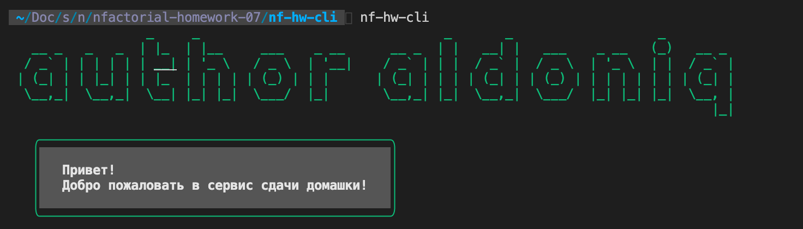

# hf-hw-cli

## Command line interface(CLI) for submitting homework **nFactorial Incubator**

## Installation

Requires NodeJS

Download package via command:

```sh
npm install -g nf-hw-cli
```

# Launch

```
nf-hw-cli
```




## More packages

Many packages coming soon...


| Social Media |
| ------ |
| [Github] 🥱 |
| [Instagram] 😉 |


## License

😆MIT😆

**Free Software, Hell Yeah!**

[//]: # (These are reference links used in the body of this note and get stripped out when the markdown processor does its job. There is no need to format nicely because it shouldn't be seen. Thanks SO - http://stackoverflow.com/questions/4823468/store-comments-in-markdown-syntax)


   [Instagram]: <https://www.instagram.com/aldoniq/>
   [Github]: <https://github.com/aldoniq>
   